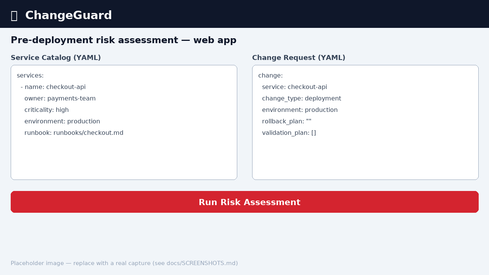
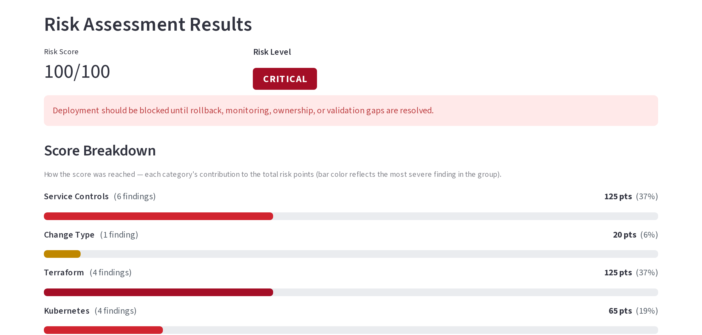
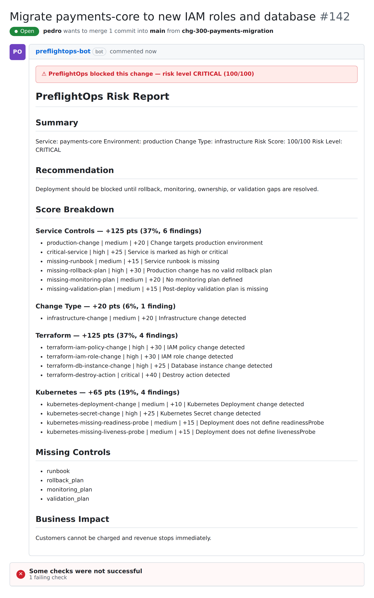

# PreflightOps

> **Preflight checks for risky production changes.** Before production changes take off, check the operational risk.

PreflightOps is a pre-deployment risk assessment tool for SRE, DevOps, and Platform Engineering teams. It turns a service catalog and a proposed change into a clear **0–100 risk score**, a **risk level** (`LOW` / `MEDIUM` / `HIGH` / `CRITICAL`), a plain-English recommendation, and an actionable list of the exact gaps to fix — *before* the change ships.

It runs as a **Streamlit web app** for interactive reviews and as a **CLI / GitHub Action** for automated pull-request gates. No database, no login, no AI — the risk assessment runs entirely locally. Outbound calls happen only when you explicitly opt in to the [ServiceNow / Jira integrations](#opt-in-push-straight-into-servicenow--jira).

[](https://github.com/pedroluna-gh/preflightops/actions/workflows/ci.yml)
[](LICENSE)
[](#requirements)



## Try it in a pull request

```yaml
- uses: pedroluna-gh/preflightops@v0.1.0
  with:
    services: services.yaml
    change: change.yaml
    terraform: tfplan.txt
    k8s: k8s.yaml
    fail-on: critical
```

---

## The problem

Most production incidents are triggered by **changes** — deployments, config updates, and infrastructure edits. Teams invest heavily in CI/CD, Terraform, Kubernetes, and observability, yet the decision *"is this change safe to ship?"* is still made by gut feel in a rushed review:

- Rollback plans are missing, vague, or untested.
- Critical services lack runbooks or a named owner.
- Monitoring and post-deploy validation are afterthoughts.
- Risky Terraform (IAM, destroy/delete, security groups) and Kubernetes (exposed Secrets, missing probes, `replicas: 0`) changes slip through review.

PreflightOps makes that judgement **explicit, consistent, and auditable**. It encodes change-governance and production-readiness checks as transparent rules so every change gets the same scrutiny — and so reviewers can focus on the findings that actually matter.

## What it checks

- Production changes without a valid rollback plan
- Critical / high-criticality services
- Missing service ownership, runbooks, and business impact
- Incomplete monitoring plans and missing post-deploy validation
- Risky Terraform signals: IAM/role changes, security groups, firewalls, DNS, KMS, database instances, public IP exposure, and `destroy` / `delete` actions
- Risky Kubernetes signals: Ingress, Secret, NetworkPolicy, StatefulSet, LoadBalancer exposure, `replicas: 0`, and Deployments missing readiness / liveness probes

## Quick demo

Try it in under a minute without writing any YAML:

```bash
# 1. Install (with the web UI extras)
pip install -e ".[app]"     # run from the preflightops/ directory

# 2. Launch the web app
streamlit run app.py
```

Then in the browser: click **Low / High / Critical Risk Example** to load a ready-made scenario, hit **Run Risk Assessment**, and explore the score, the per-category breakdown, the triggered rules, and the downloadable Markdown / JSON reports. Edit the YAML to match your own change and re-run.

Prefer the terminal? Score one of the bundled examples directly:

```bash
preflightops \
  --services examples/services-high-risk.yaml \
  --change examples/change-high-risk.yaml \
  --output report.md
```



## Installation

Install PreflightOps and its `preflightops` CLI with a single command:

```bash
pip install git+https://github.com/pedroluna-gh/preflightops.git@main
```

> Replace the URL with your own fork/repo. Once published to PyPI, this becomes `pip install preflightops`.

To also run the Streamlit web UI, add the optional `app` extras:

```bash
pip install "preflightops[app] @ git+https://github.com/pedroluna-gh/preflightops.git@main"
```

### Develop from a clone

```bash
git clone https://github.com/pedroluna-gh/preflightops.git
cd preflightops
pip install -e ".[app]"      # editable install with the web UI extras
```

`requirements.txt` does this for you: `pip install -r requirements.txt`.

### Requirements

- Python 3.9+
- Core dependency: `pyyaml`. The web UI extras add `streamlit` and `pandas`.

## Usage

### Web app

```bash
streamlit run app.py
```

Load an example, edit the **Service Catalog** and **Change Request** YAML, optionally paste a **Terraform plan** and a **Kubernetes manifest**, and click **Run Risk Assessment**. Download the result as Markdown or JSON.

### Command line

```bash
preflightops \
  --services examples/services-critical-risk.yaml \
  --change examples/change-critical-risk.yaml \
  --terraform examples/terraform-critical.txt \
  --k8s examples/k8s-risk.yaml \
  --output report.md \
  --json-output report.json
```

(The equivalent `python -m preflightops.cli ...` also works.)

The CLI prints the score and level, writes a Markdown report to `--output` (and an optional JSON report to `--json-output`), and **exits with code `1` when the risk level is `CRITICAL`** (otherwise `0`) — so you can fail a pipeline on critical risk.

### GitHub Action (PR risk gate)

PreflightOps ships with a ready-to-use workflow at [`.github/workflows/preflightops.yml`](.github/workflows/preflightops.yml). On every pull request it scores the change, posts the Markdown report as a PR comment (updated in place), uploads it as a build artifact, and **fails the check when the risk level is `CRITICAL`**.



Point the workflow at your input files via the `env` block at the top of the file:

```yaml
env:
  PREFLIGHTOPS_INSTALL: "git+https://github.com/pedroluna-gh/preflightops.git@main"
  PREFLIGHTOPS_SERVICES: services.yaml   # required: service catalog
  PREFLIGHTOPS_CHANGE: change.yaml       # required: change request
  PREFLIGHTOPS_TERRAFORM: tfplan.txt     # optional: Terraform plan/diff
  PREFLIGHTOPS_K8S: k8s.yaml             # optional: Kubernetes manifest
  PREFLIGHTOPS_REPORT: preflightops-report.md
```

Optional inputs are skipped automatically when the file is absent. The workflow needs `pull-requests: write` permission to post the comment (already declared in the example file).

You can also call the bundled composite action directly with `uses:`. It sets up Python, installs PreflightOps, runs the assessment, and gates the job on `fail-on`. Add `ticket-output` to also generate a copy/paste-ready change summary — this stays fully offline:

```yaml
- uses: pedroluna-gh/preflightops@v0.1.0
  with:
    services: services.yaml
    change: change.yaml
    terraform: tfplan.txt
    k8s: k8s.yaml
    output: preflightops-report.md
    ticket-output: preflightops-ticket.md
    fail-on: critical
```

Live ServiceNow/Jira push is optional and should only be enabled in trusted workflows, with credentials provided through GitHub Actions secrets — see [Opt-in: push from the GitHub Action](#opt-in-push-from-the-github-action) and the [GitHub Action guide](docs/GITHUB_ACTION.md).

## ServiceNow / Jira-ready change summaries

PreflightOps can generate a copy/paste-friendly Markdown change summary for ServiceNow, Jira, CAB reviews, or internal approval workflows.

It does **not** require ServiceNow or Jira API access, authentication, tokens, or any network call. It simply turns the risk assessment into a structured change-record-style ticket you can paste into your change-management tool of choice.

Add `--ticket-output` to write the summary alongside the normal report:

```bash
preflightops \
  --services examples/services-critical-risk.yaml \
  --change examples/change-critical-risk.yaml \
  --terraform examples/terraform-critical.txt \
  --k8s examples/k8s-risk.yaml \
  --output report.md \
  --ticket-output ticket.md
```

The ticket includes the change title, service, environment, business impact, risk level and score, a risk-level-aware approval recommendation and deployment window, the rollback / monitoring / validation plans (with fallback text when missing), the risk findings, and recommended actions. See a full sample in [`examples/ticket-critical.md`](examples/ticket-critical.md) and the [ticket generator guide](docs/TICKET_GENERATOR.md).

> `--ticket-output` is a copy/paste summary generator: it makes **no network calls** and needs **no credentials**.

### Customize the ticket layout

The change summary uses a built-in layout, but you can tailor it with
`--ticket-template` — a YAML or JSON file that controls the section order,
headings, and the approval / deployment-window wording. The template shapes the
summary everywhere it is produced (the `--ticket-output` file and any opt-in
ServiceNow / Jira push below), and any sections you leave out fall back to the
built-in defaults.

```bash
preflightops \
  --services examples/services-critical-risk.yaml \
  --change examples/change-critical-risk.yaml \
  --output report.md \
  --ticket-output ticket.md \
  --ticket-template my-cab-template.yaml
```

### Opt-in: push straight into ServiceNow / Jira

If you want the assessment to flow directly into your change-management tool, add
the opt-in `--servicenow` and/or `--jira` flags. These take the **non-secret**
instance/base URL; every credential is read from the environment only and is
never accepted on the command line or hard-coded.

```bash
# Credentials via environment/secrets only — never on the command line.
export SERVICENOW_USER=...        # ServiceNow
export SERVICENOW_PASSWORD=...
export JIRA_EMAIL=...             # Jira
export JIRA_API_TOKEN=...
export JIRA_PROJECT_KEY=OPS

preflightops \
  --services examples/services-critical-risk.yaml \
  --change examples/change-critical-risk.yaml \
  --output report.md \
  --servicenow https://dev12345.service-now.com \
  --jira https://example.atlassian.net
```

This **creates or updates** a ServiceNow `change_request` and/or a Jira issue
using the generated change summary as the record body. A second run for the same
change updates the existing record instead of creating a duplicate (a
deterministic correlation id is stored on the record). Set `JIRA_ISSUE_TYPE` to
override the default issue type (`Task`).

Before any live push, PreflightOps prints the target instance/base URL, the
deterministic correlation id, and that a matching record is updated if it exists
(otherwise created), then asks for an explicit confirmation — so a typo or a
copy-pasted command never silently reaches a production change-management system.
Pass `--yes` (alias `--assume-yes`) to skip the prompt for CI/automation. When
there is no interactive terminal and `--yes` was not given, the push is skipped
(no API call) and the run exits cleanly.

The integration is **strictly opt-in**: when you omit both flags, PreflightOps
makes no outbound network calls and the offline `--ticket-output` path keeps
working exactly as before. An integration misconfiguration (missing credentials,
bad URL, API error) is reported to stderr and exits non-zero **without** touching
the offline report paths.

### Opt-in: push from the GitHub Action

The composite action can run the same opt-in push, so the ServiceNow
`change_request` and/or Jira issue is created or updated as part of the
pull-request check.

It stays **off by default**: the Action behaves exactly as it does today until
you pass a non-secret `servicenow` and/or `jira` URL as an action input. Because
a CI runner has no interactive terminal, set `assume-yes: true` to waive the
confirmation prompt. Provide the credentials as **GitHub repository secrets**
(Settings → Secrets and variables → Actions) through the job's `env` block — never
on the command line:

```yaml
jobs:
  risk-review:
    runs-on: ubuntu-latest
    env:
      SERVICENOW_USER: ${{ secrets.SERVICENOW_USER }}
      SERVICENOW_PASSWORD: ${{ secrets.SERVICENOW_PASSWORD }}
      JIRA_EMAIL: ${{ secrets.JIRA_EMAIL }}
      JIRA_API_TOKEN: ${{ secrets.JIRA_API_TOKEN }}
      JIRA_PROJECT_KEY: ${{ secrets.JIRA_PROJECT_KEY }}
    steps:
      - uses: actions/checkout@v4
      - uses: pedroluna-gh/preflightops@v0.1.0
        with:
          services: services.yaml
          change: change.yaml
          ticket-output: preflightops-ticket.md
          servicenow: https://dev12345.service-now.com  # enables --servicenow
          jira: https://example.atlassian.net           # enables --jira
          assume-yes: true
```

The secrets above map to the environment variables the CLI reads:

| Secret | Used by | Required |
| --- | --- | --- |
| `SERVICENOW_USER` | ServiceNow | when the `servicenow` input is set |
| `SERVICENOW_PASSWORD` | ServiceNow | when the `servicenow` input is set |
| `JIRA_EMAIL` | Jira | when the `jira` input is set |
| `JIRA_API_TOKEN` | Jira | when the `jira` input is set |
| `JIRA_PROJECT_KEY` | Jira | when the `jira` input is set |
| `JIRA_ISSUE_TYPE` | Jira | optional (defaults to `Task`) |

Omit `servicenow` / `jira` (or leave them blank) to keep both integrations
disabled — no secrets are needed and no network call is made. Because re-runs are
matched by a deterministic correlation id, repeated pushes for the same change
update the existing record instead of creating duplicates.

### Opt-in: send from the web app

The Streamlit app exposes the same opt-in integration. After running an
assessment, the **Send to ServiceNow / Jira (live)** section lets you create or
update a real ServiceNow `change_request` and/or Jira issue from the generated
summary. To prevent an accidental push to a production system, each send is
gated behind a **Review before sending** step: expand it to see the target
instance/base URL and the create-or-update action, tick the confirmation
checkbox, and only then does the **Send** button become enabled.

As with the CLI, credentials are read from the environment only (the same
`SERVICENOW_USER` / `SERVICENOW_PASSWORD` and `JIRA_EMAIL` / `JIRA_API_TOKEN` /
`JIRA_PROJECT_KEY` variables). The send controls stay hidden — with guidance on
which variables to set — until the integration is configured, so the app makes
no outbound network calls unless you opt in.

## Example output

A `HIGH`-risk production deployment produces a report like this:

```markdown
# PreflightOps Risk Report

## Summary

Service: checkout-api
Environment: production
Change Type: deployment
Risk Score: 80/100
Risk Level: HIGH

## Recommendation

Senior review recommended before deployment. Address missing controls before proceeding.

## Score Breakdown

### Service Controls — +80 pts (100%, 4 findings)

- production-change | medium | +20 | Change targets production environment
- critical-service | high | +25 | Service is marked as high or critical
- missing-monitoring-plan | medium | +20 | No monitoring plan defined
- missing-validation-plan | medium | +15 | Post-deploy validation plan is missing

## Missing Controls

- monitoring_plan
- validation_plan

## Business Impact

Customers may be unable to complete checkout
```

The JSON report (`--json-output`) contains the same data plus a grouped `score_breakdown` summary, ready for tooling and auditing.

## How scoring works

PreflightOps sums the points from every triggered rule and scanner finding, capping the total at 100:

| Score   | Level      | What it means                                                        |
| ------- | ---------- | ------------------------------------------------------------------- |
| 0–30    | `LOW`      | Proceed with the normal deployment process.                         |
| 31–60   | `MEDIUM`   | Proceed with caution; ensure owner review and post-deploy checks.   |
| 61–80   | `HIGH`     | Senior review recommended; address missing controls first.          |
| 81–100  | `CRITICAL` | Block until rollback, monitoring, ownership, or validation gaps close. |

Findings are grouped by source — **Service Controls**, **Change Type**, **Terraform**, and **Kubernetes** — so you can see exactly where the risk comes from.

> **Note:** Final risk score is capped at 100. Breakdown values show raw contributing points before the cap is applied.

## Project structure

```
preflightops/
├── app.py                     # Streamlit web app (UI, example loader, results)
├── preflightops/               # Core package
│   ├── risk_engine.py         # Rules, scoring, levels, recommendations
│   ├── validators.py          # Rollback / monitoring / validation plan checks
│   ├── scanners.py            # Terraform & Kubernetes keyword risk scanners
│   ├── report.py              # Markdown & JSON report generators
│   ├── sample_data.py         # Built-in low/high/critical scenarios
│   └── cli.py                 # Command-line entry point (exit 1 on CRITICAL)
├── examples/                  # Example YAML / text inputs for each scenario
├── tests/                     # pytest suite (engine, validators, scanners, CLI, UI)
├── .github/workflows/         # Ready-to-use PR risk-gate Action
├── pyproject.toml             # Packaging + console script + optional extras
└── requirements.txt           # Editable install for local development
```

## Running the tests

PreflightOps ships with a `pytest` suite covering the risk-engine rules, the rollback/monitoring/validation validators, the Terraform/Kubernetes scanners (including the readiness/liveness probe checks), the CLI and report generators, the web UI, and the documented LOW / HIGH / CRITICAL scenarios.

```bash
pip install -r requirements.txt
pytest
```

Run from the `preflightops/` directory. Tests live under `tests/`.

## Contributing

Contributions are welcome — bug reports, new risk rules, scanner signals, and docs all help.

1. Fork the repo and create a feature branch.
2. Make your change and **add or update tests** under `tests/`.
3. Run `pytest` and make sure the full suite passes.
4. Keep the project's constraints intact: **no database, no login, no AI, and no network calls by default** — the only outbound calls are the explicitly opt-in ServiceNow / Jira integrations.
5. Open a pull request with a clear description of the change and the risk it addresses.

New risk rules should be transparent and explainable: a stable rule id, a severity, a point value, and a human-readable description. Please open an issue first for larger changes so we can align on direction.

## Security

PreflightOps is **offline by default**: the risk assessment makes no outbound network calls, stores no data, and requires no credentials. Your service catalogs, change requests, Terraform plans, and Kubernetes manifests never leave your machine or CI runner — unless you explicitly enable the opt-in ServiceNow / Jira integrations, which send the generated change summary to the instance/base URL you configure using credentials read from the environment only.

- Treat any input you paste as sensitive — Terraform plans and Kubernetes manifests can contain infrastructure details. The bundled examples use placeholder data only.
- PreflightOps is a **decision-support aid, not a security boundary.** It surfaces risk signals to inform human review; it does not guarantee a change is safe.
- Found a vulnerability? Please report it privately via a GitHub security advisory rather than a public issue.

## Roadmap

- Copy/paste ServiceNow/Jira-ready change ticket summary (`--ticket-output`) — **available now**
- Opt-in ServiceNow API integration and Jira API integration (`--servicenow` / `--jira`), from the CLI, GitHub Action, and web app — **available now**
- Configurable / custom ticket templates (`--ticket-template`) — **available now**
- Real Terraform plan JSON parser
- Real Kubernetes YAML object parser
- PagerDuty / Opsgenie incident-history connector
- Datadog / Grafana dashboard link validation
- Static HTML dashboard export
- Policy-as-code approval workflows

## Suggested GitHub topics

When publishing, add topics like:

`sre` · `devops` · `platform-engineering` · `site-reliability-engineering` · `change-management` · `risk-assessment` · `production-readiness` · `rollback` · `observability` · `terraform` · `kubernetes` · `ci-cd` · `pre-deployment` · `streamlit` · `python`

## License

Released under the [MIT License](LICENSE).

---

_Built for SRE, DevOps, Platform Engineering and Cloud Operations teams._
